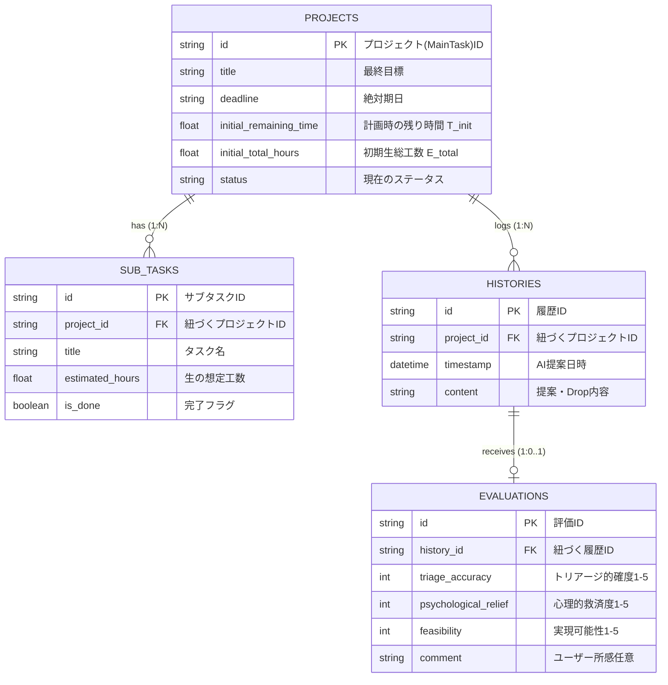

# データベース設計

## 概要

本ドキュメントは、AI-Driven Reverse Scheduler の永続化層の設計を定義する。本システムは短期間プロジェクトにおいて「絶対期日を守る」ことを目的としており、プロジェクト（メインタスク）、AI が生成したサブタスク、トリアージ履歴、およびユーザー評価を中心にデータを管理する。

データベース選定は、ハッカソン開発速度と環境構築の容易さを最優先とする。現状の MVP では永続化に SQLite（またはローカルファイル）を想定しており、必要に応じて PostgreSQL 等への移行を検討する。

## テーブル構成と役割

### PROJECTS（プロジェクト）

プロジェクトの全体目標、絶対期日、およびバッファ計算の基準となる初期スナップショットを保存する。

| カラム名 | 型 | 制約 | 説明 |
| --- | --- | --- | --- |
| id | string | PK | プロジェクト（MainTask）ID |
| title | string | NOT NULL | 最終目標 |
| deadline | string | NOT NULL | 絶対期日 |
| initial_remaining_time | float | NOT NULL | 計画時の残り時間 `T_init` |
| initial_total_hours | float | NOT NULL | 初期生総工数 `E_total` |
| status | string | NOT NULL | 現在のステータス（Green / Yellow / Red） |

### SUB_TASKS（サブタスク）

AI によって生成された WBS（サブタスク）のリストと、個々の進捗状態を保存する。

| カラム名 | 型 | 制約 | 説明 |
| --- | --- | --- | --- |
| id | string | PK | サブタスクID |
| project_id | string | FK, NOT NULL | 紐づくプロジェクトID |
| title | string | NOT NULL | タスク名 |
| estimated_hours | float | NOT NULL | 生の想定工数 |
| is_done | boolean | NOT NULL, DEFAULT false | 完了フラグ |

### HISTORIES（履歴）

AI によるトリアージ（要件 Drop 等）の提案履歴をタイムラインとして記録する。

| カラム名 | 型 | 制約 | 説明 |
| --- | --- | --- | --- |
| id | string | PK | 履歴ID |
| project_id | string | FK, NOT NULL | 紐づくプロジェクトID |
| timestamp | datetime | NOT NULL | AI 提案日時 |
| content | string | NOT NULL | 提案・Drop 内容 |

### EVALUATIONS（評価）

トリアージ履歴に対するユーザーの評価（的確度、心理的救済度、実現可能性）を保存し、次回 AI API 呼び出し時にプロンプトへフィードバックする。

| カラム名 | 型 | 制約 | 説明 |
| --- | --- | --- | --- |
| id | string | PK | 評価ID |
| history_id | string | FK, NOT NULL, UNIQUE | 紐づく履歴ID |
| triage_accuracy | int | NOT NULL | トリアージ的確度（1-5） |
| psychological_relief | int | NOT NULL | 心理的救済度（1-5） |
| feasibility | int | NOT NULL | 実現可能性（1-5） |
| comment | string |  | ユーザー所感（任意） |

## E-R 図

